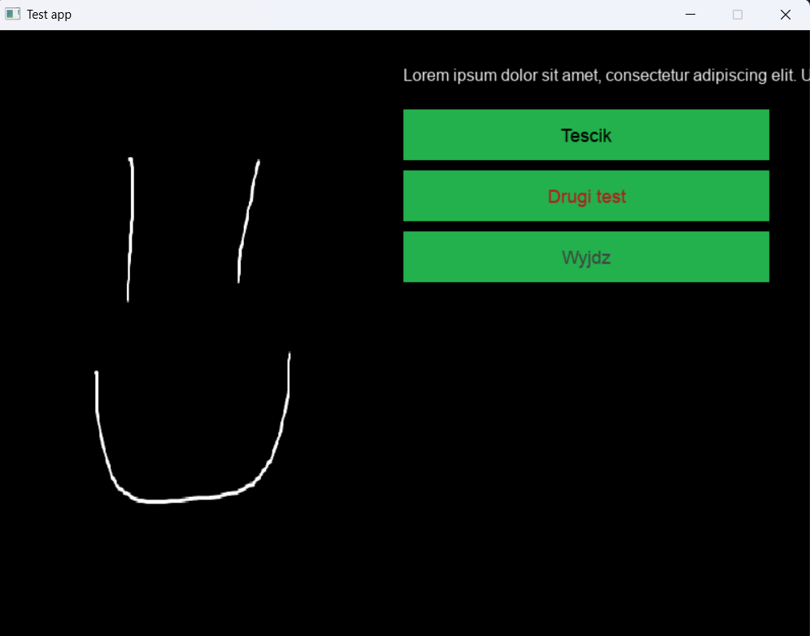

# PJREngine



A game engine for text adventure games written in Golang. It supports its own scripting language called the [PJRScript](https://github.com/jegor377/PJRCompiler). PJR in the name doesn't mean anything. It's a little project made in 2018 and updated in 2025 to the newest Golang compiler.

# Compilation Procedure

Open the terminal in the project's directory, write the code below and press enter:

```bash
go build ./main
```

# Requirements

- Golang 1.25.4
- [SDL2 2.32.6](https://github.com/libsdl-org/SDL/releases/tag/release-2.32.6)
- [SDL2-image 2.8.8](https://github.com/libsdl-org/SDL_image/releases/tag/release-2.8.8)
- [SDL2-mixer 2.8.1](https://github.com/libsdl-org/SDL_mixer/releases/tag/release-2.8.1)
- [SDL-ttf 2.24.0](https://github.com/libsdl-org/SDL_ttf/releases/tag/release-2.24.0)